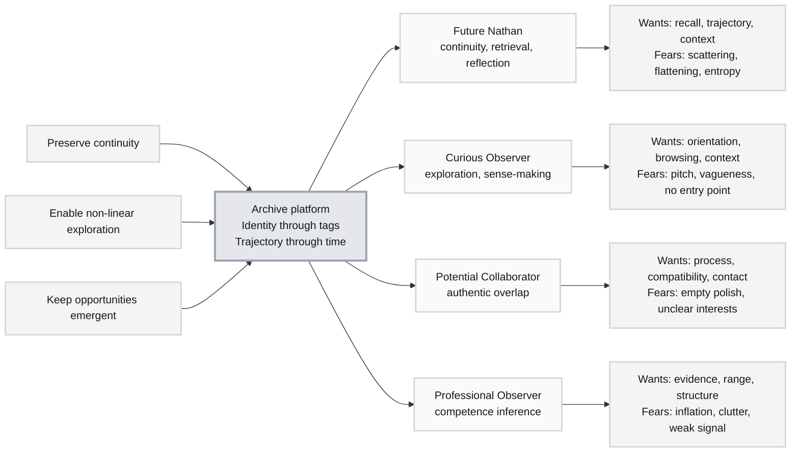

# Trigger Map: Nathan Mike Sidi Bakari

> Simplified strategic map connecting archive goals to visitor psychology.

**Created:** 2026-04-21
**Phase:** 2 - Simplified Trigger Mapping
**Agent:** Saga (Analyst)
**Source:** [Phase 1 Handover Summary](../A-Product-Brief/05-phase-1-handover-summary.md)

---

## Strategic Documents

| # | Document | Purpose | Status |
|---|----------|---------|--------|
| 01 | [Strategic Context](./01-strategic-context.md) | Goals, constraints, and visitor-mode strategy | Complete |
| 02 | [Future Nathan](./02-future-nathan.md) | Primary visitor mode: continuity and retrieval | Complete |
| 03 | [Curious Observer](./03-curious-observer.md) | Secondary visitor mode: open exploration | Complete |
| 04 | [Potential Collaborator](./04-potential-collaborator.md) | Secondary visitor mode: authentic overlap | Complete |
| 05 | [Professional Observer](./05-professional-observer.md) | Secondary visitor mode: competence inference | Complete |
| 06 | [Feature Impact Analysis](./06-feature-impact-analysis.md) | Prioritized structures and features | Complete |
| 07 | [Key Insights](./07-key-insights.md) | Design implications for UX scenarios | Complete |

---

## Vision

The site is a self-addressed archive with public access: a durable, multi-domain, temporally indexed record of personal output where identity is expressed through tagged entries rather than narrative positioning.

---

## Archive Objectives

### Objective 1: Preserve continuity

- **Statement:** Make Nathan's output retrievable and understandable over time.
- **Measure:** Entries have consistent metadata, dates, tags, and context.
- **Design implication:** Timeline and entry pages are core infrastructure, not secondary views.

### Objective 2: Enable non-linear exploration

- **Statement:** Let visitors move through entries by identity, time, and selection.
- **Measure:** Every entry is reachable through collections/tags and timeline.
- **Design implication:** Collections and timeline must be generated from the same content model.

### Objective 3: Keep opportunities emergent

- **Statement:** Allow collaborations or professional opportunities without engineering for conversion.
- **Measure:** Contact and RSS are available but visually quiet.
- **Design implication:** No dominant CTA, no funnel, no aggressive self-promotion.

---

## Visitor Modes

### 1. Future Nathan

**Priority:** Primary

Future Nathan returns to recover continuity: what was made, when it happened, what it meant, and how it connects to other work.

**Positive drivers:**

- Wants durable recall across years.
- Wants trajectory to be visible.
- Wants entries to preserve context and process.

**Negative drivers:**

- Fears losing work in scattered tools.
- Fears flattening his identity into one domain.
- Fears future content becoming hard to maintain.

### 2. Curious Observer

**Priority:** Secondary

The Curious Observer arrives without a defined task and needs a clear way to browse without being sold to.

**Positive drivers:**

- Wants to understand the shape of the archive quickly.
- Wants non-linear browsing across domains.
- Wants enough context to keep exploring.

**Negative drivers:**

- Fears vague personal-brand language.
- Fears being trapped in a pitch.
- Fears not knowing where to start.

### 3. Potential Collaborator

**Priority:** Secondary

The Potential Collaborator is looking for genuine overlap: technical, creative, entrepreneurial, intellectual, or some combination of these.

**Positive drivers:**

- Wants evidence of process and taste.
- Wants to see cross-domain compatibility.
- Wants a low-pressure way to make contact.

**Negative drivers:**

- Fears polished claims without substance.
- Fears unclear interests or unavailable context.
- Fears contact feeling transactional or forced.

### 4. Professional Observer

**Priority:** Secondary

The Professional Observer infers competence from concrete entries, breadth, and consistency.

**Positive drivers:**

- Wants credible examples of capability.
- Wants to understand domain range and trajectory.
- Wants enough structure to evaluate quickly.

**Negative drivers:**

- Fears inflated positioning.
- Fears weak signal hidden inside clutter.
- Fears no clear way to inspect relevant work.

---

## Trigger Map Visualization

---

## Design Focus Statement

The portfolio should transform scattered personal output into a durable archive that supports free exploration through time, identity, and curated entry points, while avoiding the tone and structure of a conversion-focused portfolio.

**Primary design target:** Future Nathan

**Must address:**

- Recall: each entry needs metadata and context.
- Continuity: timeline must make trajectory visible.
- Multiplicity: collections/tags must support multi-domain identity.
- Maintenance: content structures must be simple enough to use for years.

**Should address:**

- Curious observers need orientation and entry points.
- Collaborators need evidence of process and overlap.
- Professional observers need credible structure without inflated claims.
- Notes readers need RSS and readable editorial pages.

---

## Cross-Mode Patterns

### Shared Drivers

- Orientation without over-explanation.
- Evidence through entries.
- Navigation by both time and identity.
- Low-pressure discovery.
- Clear metadata.

### Unique Drivers

- Future Nathan needs continuity and maintainability.
- Curious Observer needs an immediate starting point.
- Potential Collaborator needs process and contact.
- Professional Observer needs fast signal and credible examples.

### Potential Tensions

- Future Nathan benefits from completeness; external observers benefit from curation.
- Professional observers may expect a conventional portfolio; the project intentionally resists that framing.
- Notes need editorial polish, but the archive must still preserve process and evolution.

---

## Next Steps

- [ ] Use this map to define Phase 3 UX scenarios.
- [ ] Keep visitor modes as design checks, not target-market personas.
- [ ] Validate every proposed page against at least one driver.

---

_Generated with Whiteport Design Studio framework_
